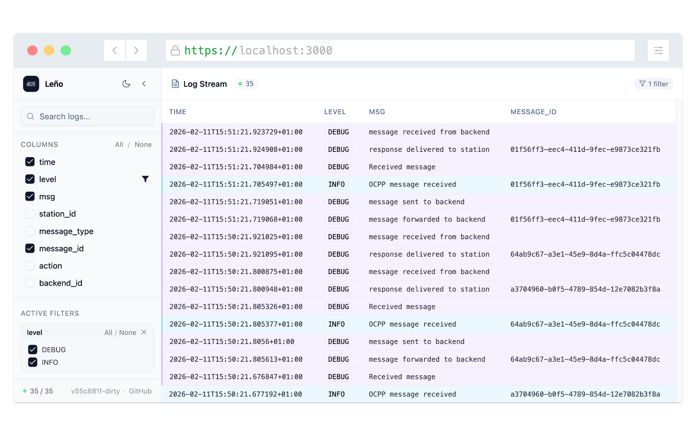

<div align="center">
	
	<p>
		<b>Command line log viewer with a web UI</b>
	</p>
	<br>
	<a href="https://contributionswelcome.org/"></a>
	<a href="https://choosealicense.com/licenses/mit/"></a>
	<br>
	<br>
</div>

Leño is a [JSON lines](https://jsonlines.org/) log viewer with a web UI. Think of it as local Kibana/Sumo Logic for development. Works great with [Pino](https://getpino.io/) logging library, any other app that logs into JSON, nginx/nginx-ingress access logs, or [logfmt](https://brandur.org/logfmt) structured logs.



## Installation

Download the latest binary for your platform from the [releases page](https://github.com/suda/leno/releases) and place it somewhere on your `$PATH`.

Or build from source (requires Go 1.21+ and Node.js for the Svelte build step):

```sh
git clone https://github.com/suda/leno
cd leno
npm install
make build
```

This produces a single `./leno` binary with the web UI embedded — no runtime dependencies.

## Usage

Pipe your app's output to `leno`:

```sh
$ ./myapp | leno
Leno running on http://localhost:3000
```

Now open [http://localhost:3000](http://localhost:3000) to see logs stream in real time.

### Custom port

```sh
$ LENO_PORT=8080 ./myapp | leno
Leno running on http://localhost:8080
```

### Example with Pino

```sh
$ node server.js | leno
```

### Nginx / nginx-ingress access logs

Use `--log-format=nginx` to parse nginx access logs (both the standard [combined log format](https://nginx.org/en/docs/http/ngx_http_log_module.html) and the extended [nginx-ingress format](https://kubernetes.github.io/ingress-nginx/user-guide/nginx-configuration/log-format/)). Each line is converted to a JSON object before display.

```sh
# Local nginx
$ tail -f /var/log/nginx/access.log | leno --log-format=nginx

# Kubernetes nginx-ingress
$ kubectl logs -n nginx -l app.kubernetes.io/name=ingress-nginx \
    --all-containers=true -f | leno --log-format=nginx
```

The following fields are extracted:

| Field | Type | Description |
|---|---|---|
| `remote_addr` | string | Client IP address |
| `remote_user` | string | Authenticated user (`-` if none) |
| `time` | string | Request time in RFC 3339 UTC |
| `method` | string | HTTP method |
| `path` | string | Request path |
| `http_version` | string | HTTP version |
| `status` | number | HTTP response status code |
| `body_bytes` | number | Bytes sent to client |
| `http_referer` | string | `Referer` header |
| `http_user_agent` | string | `User-Agent` header |
| `request_length` | number | *(nginx-ingress)* Request size in bytes |
| `request_time` | number | *(nginx-ingress)* Request processing time in seconds |
| `upstream_name` | string | *(nginx-ingress)* Upstream service name |
| `upstream_addr` | string | *(nginx-ingress)* Upstream pod address |
| `upstream_response_time` | string | *(nginx-ingress)* Upstream response time(s) |
| `upstream_status` | number | *(nginx-ingress)* Upstream response status code |
| `request_id` | string | *(nginx-ingress)* Unique request ID |

Lines that don't match either format are passed through as-is, so mixed log streams (e.g. nginx error lines alongside access lines) are handled gracefully.

### logfmt logs

Use `--log-format=logfmt` to parse [logfmt](https://brandur.org/logfmt) logs — a simple `key=value` format used by many Go and Ruby libraries (e.g. [logrus](https://github.com/sirupsen/logrus), [log/slog](https://pkg.go.dev/log/slog) with a text handler, [Heroku router logs](https://devcenter.heroku.com/articles/http-routing#heroku-router-log-format)).

```sh
$ ./myapp | leno --log-format=logfmt
```

Each line is parsed into a JSON object. String values that look like integers, floats, or booleans (`true`/`false`) are coerced to the appropriate type. Lines that contain no valid `key=value` pairs are passed through as-is.

### Generate fake logs for testing

```sh
$ ./scripts/generate-fake-logs.sh | leno
```

## Building from source

Requirements: Go 1.21+, Node.js (build only)

```sh
# Install JS build dependencies
npm install

# Build Svelte app and compile Go binary
make build        # produces ./leno

# Development (Svelte hot-reload)
make dev          # runs rollup in watch mode; run ./leno separately

# Clean build artifacts
make clean
```

## Credits

Leño's logo is based on [log by Smalllike](https://thenounproject.com/term/log/2784204) from the Noun Project.