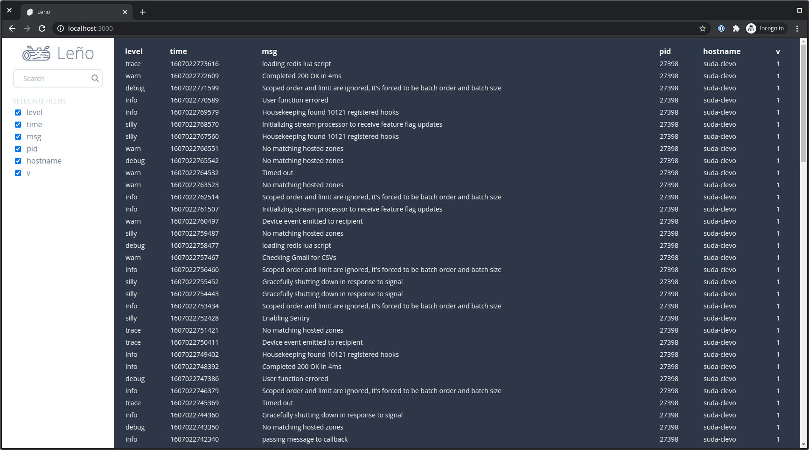

<div align="center">
	
	<p>
		<b>Command line log viewer with a web UI</b>
	</p>
	<br>
	<a href="https://contributionswelcome.org/"></a>
	<a href="https://choosealicense.com/licenses/mit/"></a>
	<br>
	<br>
</div>

Leño is a [JSON lines](https://jsonlines.org/) log viewer with a web UI. Think of it as local Kibana/Sumo Logic for development. Works great with [Pino](https://getpino.io/) logging library or any other app that logs into JSON.



## Installation

Download the latest binary for your platform from the [releases page](https://github.com/suda/leno/releases) and place it somewhere on your `$PATH`.

Or build from source (requires Go 1.21+ and Node.js for the Svelte build step):

```sh
git clone https://github.com/suda/leno
cd leno
npm install
make build
```

This produces a single `./leno` binary with the web UI embedded — no runtime dependencies.

## Usage

Pipe your app's output to `leno`:

```sh
$ ./myapp | leno
Leno running on http://localhost:3000
```

Now open [http://localhost:3000](http://localhost:3000) to see logs stream in real time.

### Custom port

```sh
$ LENO_PORT=8080 ./myapp | leno
Leno running on http://localhost:8080
```

### Example with Pino

```sh
$ node server.js | leno
```

### Generate fake logs for testing

```sh
$ ./scripts/generate-fake-logs.sh | leno
```

## Building from source

Requirements: Go 1.21+, Node.js (build only)

```sh
# Install JS build dependencies
npm install

# Build Svelte app and compile Go binary
make build        # produces ./leno

# Development (Svelte hot-reload)
make dev          # runs rollup in watch mode; run ./leno separately

# Clean build artifacts
make clean
```

## Credits

Leño's logo is based on [log by Smalllike](https://thenounproject.com/term/log/2784204) from the Noun Project.